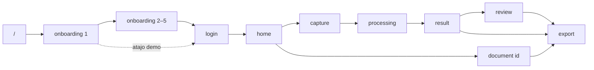

# Mapa de flujo demo — Claridad

Flujo principal validado en Fase 6C. Rutas canónicas definidas en `src/types/navigation.ts`.

---

## Diagrama



---

## Flujo principal (demo estándar)

| Paso | Pantalla | Ruta Expo Router | Archivo | Navegación |
|------|----------|------------------|---------|------------|
| 0 | Redirect arranque | `/` | `app/index.tsx` | Auto → onboarding 1 |
| 1 | Del caos al orden | `/(onboarding)/chaos-to-order` | `app/(onboarding)/chaos-to-order.tsx` | **Comenzar** → paso 2 |
| 2 | Fotografiar página | `/(onboarding)/photograph-page` | `app/(onboarding)/photograph-page.tsx` | **Siguiente** → paso 3 |
| 3 | Fragmentos detectados | `/(onboarding)/fragments-detected` | `app/(onboarding)/fragments-detected.tsx` | **Siguiente** → paso 4 |
| 4 | Agrupado por temas | `/(onboarding)/grouped-by-topics` | `app/(onboarding)/grouped-by-topics.tsx` | **Siguiente** → paso 5 |
| 5 | Revisar antes de confiar | `/(onboarding)/review-before-trust` | `app/(onboarding)/review-before-trust.tsx` | **Crear cuenta** → login |
| 6 | Login | `/(auth)/login` | `app/(auth)/login.tsx` | Cualquier CTA → home |
| 7 | Home | `/(app)/home` | `app/(app)/home.tsx` | FAB → capture |
| 8 | Capturar | `/(capture)/capture` | `app/(capture)/capture.tsx` | Obturador → processing |
| 9 | Procesando | `/(capture)/processing` | `app/(capture)/processing.tsx` | Auto (~3,5 s) → result |
| 10 | Resultado | `/(document)/result` | `app/(document)/result.tsx` | **Más** → review; **Exportar** → export |
| 11 | Revisar | `/(document)/review` | `app/(document)/review.tsx` | **Todo coincide** → export |
| 12 | Exportar | `/(document)/export` | `app/(document)/export.tsx` | Toast; cerrar con X |

**Constantes en código (`ClaridadRoutes`):**

```
onboarding1  → /(onboarding)/chaos-to-order
onboarding2  → /(onboarding)/photograph-page
onboarding3  → /(onboarding)/fragments-detected
onboarding4  → /(onboarding)/grouped-by-topics
onboarding5  → /(onboarding)/review-before-trust
auth         → /(auth)/login
home         → /(app)/home
capture      → /(capture)/capture
processing   → /(capture)/processing
result       → /(document)/result
review       → /(document)/review
export       → /(document)/export
```

---

## Atajo demo (sin onboarding 2–5)

| Paso | Ruta | Gesto |
|------|------|-------|
| 1 | `/(onboarding)/chaos-to-order` | **¿Ya tienes cuenta? Iniciar sesión** |
| 2 | `/(auth)/login` | **Iniciar sesión** (o social) |
| 3+ | Igual que flujo principal desde Home | — |

---

## Rutas secundarias (opcionales)

| Pantalla | Ruta | Cómo llegar | Uso en demo |
|----------|------|-------------|-------------|
| Empty state | `/(app)/empty` | Manual / dev | Mostrar primer uso sin documentos |
| Vista documento | `/(document)/[id]` | Tap tarjeta en Home | Ej. `/(document)/doc-ideas-proyecto` |
| Settings | `/settings` | Icono ajustes en Home | Cuenta, preferencias (mock) |

---

## Tiempos clave

| Evento | Duración |
|--------|----------|
| Processing: 4 pasos × 750 ms + navegación | ~3,45 s |
| Review → Export tras confirmar | ~420 ms |
| Export toast visible | ~2 s (aprox.) |

---

## Layouts y transiciones (referencia)

| Grupo | Layout | Transición típica |
|-------|--------|-------------------|
| Root | `app/_layout.tsx` | Fade |
| Onboarding | `app/(onboarding)/_layout.tsx` | Slide from right |
| Capture | `app/(capture)/_layout.tsx` | Fade |
| Document | `app/(document)/_layout.tsx` | Slide right; export slide from bottom |

No modificar para demo — documentado solo como contexto.

---

## Recovery manual (deep links)

Si una pantalla falla, navegar directamente (Expo Router):

```
/(onboarding)/chaos-to-order
/(auth)/login
/(app)/home
/(capture)/capture
/(capture)/processing
/(document)/result
/(document)/review
/(document)/export
```

En desarrollo: usar dev menu o `router.push` desde consola de Expo si está disponible.
